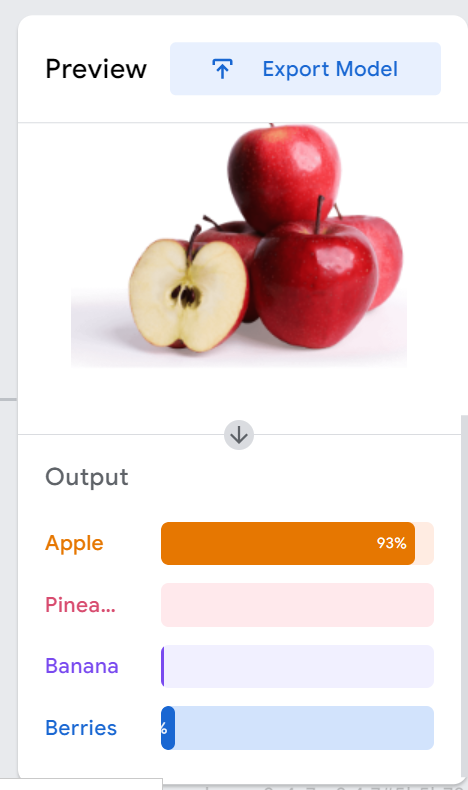

# Task4_AI

## Machine Learning
In this task, we will train the machine to identify 4 types of fruits. Using the teachable machine website.

First we will determine the number of classes and then download pictures of the fruits:

**Adjust training settings**

**Machine test**

Finally, as shown, the machine was able to identify the types of fruits by a very large percentage.
